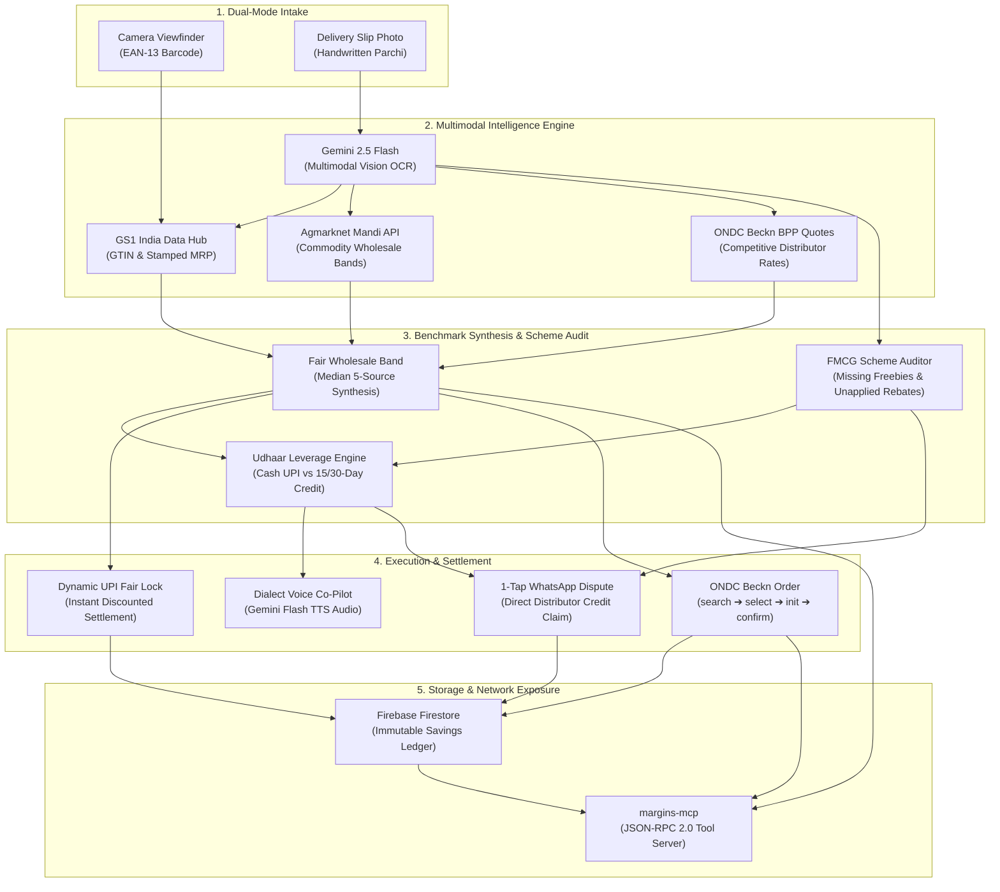

# MARGINS — Autonomous Wholesale Fairness Oracle

> **Reclaiming the ₹40 of every ₹100 lost by India's 63 million shopkeepers to pricing asymmetry, unapplied manufacturer promotions, and informal distributor locks.**

[](https://web-eight-theta-usai6pzu0g.vercel.app)
[](https://landing-gold-omega.vercel.app)
[](https://web-eight-theta-usai6pzu0g.vercel.app/api/mcp)
[](./LICENSE)

---

## Live Deployments

| Surface | URL | Description |
| :--- | :--- | :--- |
| **Mobile Web Application** | [web-eight-theta-usai6pzu0g.vercel.app](https://web-eight-theta-usai6pzu0g.vercel.app) | Mobile-first shopkeeper PWA (`/camera`, `/haggle`, `/ledger`, `/oracle`) |
| **Product Overview** | [landing-gold-omega.vercel.app](https://landing-gold-omega.vercel.app) | Architectural showcase and interactive product tour |
| **MCP Server Endpoint** | [web-eight-theta-usai6pzu0g.vercel.app/api/mcp](https://web-eight-theta-usai6pzu0g.vercel.app/api/mcp) | Standard JSON-RPC 2.0 Model Context Protocol endpoint |
| **MCP Discovery Manifest** | [web-eight-theta-usai6pzu0g.vercel.app/.well-known/mcp.json](https://web-eight-theta-usai6pzu0g.vercel.app/.well-known/mcp.json) | Machine-readable capability and tool schema manifest |

---

## The Problem: Asymmetry in India's Unorganized Retail

India's traditional retail ecosystem (General Trade / Kirana) comprises **63 million micro-enterprises (MSMEs)** responsible for over 85% of the nation's FMCG distribution. Despite their scale, local shopkeepers operate under severe structural disadvantages:

```
[ FMCG Brand / Manufacturer ] 
            │
            ▼
[ Regional C&F / Super-Stockist ]
            │  ◄── Opaque pricing, hidden schemes, selective discounts
            ▼
[ Local Distributor Truck ]
            │  ◄── Grease-stained handwritten slips ("parchis"), arbitrary markups, verbal udhaar lock
            ▼
[ Kirana Shopkeeper (Corner Store) ]  ──► 40% Margin Erosion
```

1. **Predatory Localized Pricing:** Traditional FMCG distribution is hyper-fragmented. Distributors quote arbitrary rates based on store location, distributor leverage, and perceived shopkeeper sophistication, charging up to 10–18% above fair wholesale benchmarks.
2. **The ₹45,000 Crore Trade Promotion Leakage:** FMCG manufacturers allocate massive budgets for trade schemes (e.g., *"Buy 12 boxes, get 1 free tub"*, or instant cash turnover rebates). Middlemen routinely withhold these schemes from small retailers, pocketing the free stock.
3. **The Informal Credit (*Udhaar*) Trap:** Distributors leverage 15–30 day informal credit terms to justify inflated base prices. Shopkeepers who pay ready cash (UPI) are rarely offered the 3–5% cash discounts they legally deserve.
4. **Grease-Stained Paper Invoices (*Parchis*):** Wholesale inventory arrives on handwritten carbon-copy memo slips during rush hours. Reconciliation is reactive and manual; by the time the retailer notices an overcharge at month-end, the margin has already leaked.

---

## Our Proposed Solution: The Autonomous Fairness Oracle

**MARGINS** is a phone-first, multimodal AI intelligence platform and open protocol server that equalizes the playing field for the informal retail merchant at the counter:

* **Dual-Mode Intake:** Instantaneous scanning of EAN-13 barcodes alongside multimodal computer vision OCR for multi-item handwritten paper delivery slips (*parchis*).
* **Multi-Source Benchmark Engine:** Triangulates authoritative data across **GS1 India** (verified GTIN and consumer MRP), **Agmarknet** (government mandi commodity rates), and **ONDC Beckn Network** (real-time competitive wholesale quotes).
* **FMCG Scheme & Freebie Auditor:** Cross-references national manufacturer promotional circulars against delivery slips to flag unapplied quantity schemes and withheld promotional stock.
* **Dialect Haggling Co-Pilot:** Speech negotiation engine in native languages (Tamil, Hindi, Bengali) that calculates working capital leverage (*spot cash UPI vs 15-day udhaar*) and whispers counter-arguments in real time.
* **1-Tap WhatsApp Dispute Rail & Dynamic UPI Lock:** Instantly dispatches a structured dispute notice with line-item overcharge citations to the distributor's WhatsApp, or generates a dynamic UPI QR code locking the fair discounted payment.
* **Open Infrastructure (MCP):** Exposes the entire intelligence layer as a Model Context Protocol (MCP) server, allowing any AI agent, enterprise ERP, or kirana voice bot in India to invoke wholesale pricing tools.

---

## Key Features

### 1. Dual-Mode Intake & Paper Delivery Memo (*Parchi*) Auditor
* **Barcode Camera Scanner:** Real-time camera viewfinder with animated laser reticle and sub-4-second GTIN resolution.
* **Multimodal Invoice OCR:** Point the phone camera at any handwritten or printed wholesale delivery memo. Gemini multimodal vision extracts product names, quoted rates, quantities, taxes, and stickers.
* **Discrepancy Highlighting:** Flags items billed above MRP, rates exceeding regional mandi medians, and excessive distributor margins.

### 2. Missing FMCG Scheme & Freebie Detector
* Cross-references manufacturer volume schemes (e.g., *Amul 12+1 Butter Tub Scheme*, *Parle seasonal box allowances*).
* Detects withheld bonus inventory (e.g., *"2 free tubs withheld, ₹504 leaked value"*).
* Computes total recoverable margin across both price overcharges and missing stock.

### 3. Dialect Voice Haggling & Working Capital (*Udhaar*) Leverage
* Powered by server-side Gemini Flash TTS audio proxy with native Indian voice profiles.
* Generates 7-step tactical negotiation scripts tailored to local bazaar norms.
* **Payment Terms Toggle:** Allows shopkeepers to strategically switch between *Spot Cash UPI* (demanding 3–5% cash discounts) and *15/30-Day Udhaar* (demanding extended payment terms if rates remain firm).

### 4. 1-Tap WhatsApp Dispute Rail & Dynamic UPI Settlement
* **1-Tap WhatsApp Trigger:** Generates a polite, legally grounded WhatsApp dispute notice formatted in the shopkeeper's dialect with delivery memo citations, demanding an immediate credit note (*CN*).
* **Dynamic UPI Fair Lock:** Generates dynamic `upi://pay` intents pre-filled with the fair settled amount, converting point-of-delivery payment into an irrevocable receipt.

### 5. Production ONDC Beckn v1.2 Protocol Client
* Native client implementation of the Open Network for Digital Commerce (ONDC) retail protocol (`ONDC:RET10`).
* **Cryptographic Ed25519 Signing:** Generates authentic Beckn `Authorization` digest headers for staging and production gateways.
* **Full 4-Step Transaction Flow:** Dispatches live `search → select → init → confirm` round-trips with verified BPP supplier providers.

### 6. Programmable Model Context Protocol (MCP) Server
* Fully compliant Model Context Protocol server exposing standard JSON-RPC 2.0 endpoints at `/api/mcp` with automatic discovery at `/.well-known/mcp.json`.
* Enables any external AI assistant (Claude Desktop, Cursor, local agent bots) to query Indian wholesale pricing benchmarks as native tools.

### 7. Immutable Savings Ledger
* Real-time transaction history backed by Google Cloud Firebase Firestore.
* Tracks item-by-item verified savings, overcharge frequency, and cumulative margin recovered over time.

---

## System Architecture & Workflow



### End-to-End Operational Lifecycle
1. **Intake:** Shopkeeper points the mobile camera at a packaged item or uploads a photo of a distributor's delivery challan.
2. **Grounding:** The engine extracts line items and queries authoritative Indian registries: GS1 for manufacturer MRP, Agmarknet for mandi benchmarks, and ONDC for live wholesale quotes.
3. **Audit:** Gemini multimodal vision checks for rate discrepancies and unapplied trade schemes (*e.g., missing free quantity allowances*).
4. **Action:** The shopkeeper can:
   * Listen to whispered counter-arguments in Tamil/Hindi with payment terms leverage.
   * Dispatch a structured dispute notice directly to the distributor's WhatsApp.
   * Lock in the fair rate via dynamic UPI payment.
   * Bypass predatory distributors entirely by ordering directly through ONDC Beckn.
5. **Infrastructure:** All verified margins are persisted to Firestore and exposed via JSON-RPC 2.0 through `margins-mcp`.

---

## Technology Stack

```
┌────────────────────────────────────────────────────────────────────────┐
│                        CLIENT / USER SURFACES                          │
│   Mobile Web PWA (Next.js 14)    │    External AI Agents (MCP Clients) │
└───────────────────┬────────────────────────────────┬───────────────────┘
                    │                                │
┌───────────────────▼────────────────────────────────▼───────────────────┐
│                       ORACLE APPLICATION LAYER                         │
│  • Next.js 14 App Router (Edge & Node.js Runtimes)                     │
│  • Model Context Protocol (MCP) JSON-RPC 2.0 Engine                    │
│  • Dialect Voice Synthesis Service (Gemini Flash Audio TTS)            │
│  • Parchi Multimodal Vision Service (Gemini 2.5 Flash Vision)          │
│  • ONDC Beckn Protocol Engine (Ed25519 Request Signatures)             │
└───────────────────┬────────────────────────────────┬───────────────────┘
                    │                                │
┌───────────────────▼────────────────────────────────▼───────────────────┐
│                      DATA & REGISTRY INTEGRATIONS                      │
│   GS1 India Registry   │  Agmarknet Mandi API  │  Firebase Firestore   │
└────────────────────────────────────────────────────────────────────────┘
```

| Domain | Technology / Service | Role in MARGINS |
| :--- | :--- | :--- |
| **Multimodal Vision & Reasoning** | **Google Gemini 2.5 Flash** | OCR on handwritten delivery slips, structured line-item extraction, pricing band reasoning |
| **Multilingual Speech** | **Gemini Flash Audio TTS** | Multi-speaker voice synthesis in Tamil (`ta-IN`), Hindi (`hi-IN`), and Indian English |
| **Semantic Search** | **Gemini Embedding 2** | Vector indexing across transaction items in the kirana margins ledger |
| **Commerce Protocol** | **ONDC Beckn JSON-LD v1.2** | Decentralized B2B/B2C commerce transactions with Ed25519 cryptographic headers |
| **Authoritative Registries** | **GS1 India Data Hub** | Authoritative GTIN verification, brand identity, and legal sticker MRP |
| **Commodity Benchmarks** | **Agmarknet Mandi Data** | Real-time wholesale mandi rates across Indian agricultural and staple commodities |
| **Tool Calling Protocol** | **Model Context Protocol (MCP)** | Standardized JSON-RPC 2.0 tool interface for external AI assistants |
| **Frontend Framework** | **Next.js 14 (App Router)** | Mobile-first responsive Progressive Web Application |
| **Styling & Design** | **Tailwind CSS + PostCSS** | Custom radiant light-theme system optimized for high-contrast outdoor readability |
| **Persistence & Audit** | **Google Cloud Firestore** | Real-time persistence for merchant transaction history and savings logs |

---

## Model Context Protocol (MCP) Integration

MARGINS is not just an application—it is programmable commerce infrastructure. External AI agents can invoke MARGINS as an MCP tool server.

### Supported Tools

| Tool Name | Arguments | Output |
| :--- | :--- | :--- |
| `fair_price_band` | `gtin` (string), `city` (string) | Median wholesale price, fair band (low–high), source citations, and haggling hints |
| `place_beckn_order` | `gtin` (string), `city` (string), `maxPrice` (number) | Dispatches full Beckn `search → select → init → confirm` cycle and returns verified Order ID |
| `query_margins_ledger` | `merchantId` (string), `limit` (number) | Historical transaction records, cumulative recovered margins, and audit trails |

### Wire into Claude Desktop or Cursor

Add the following to your configuration file (`~/Library/Application Support/Claude/claude_desktop_config.json` or `~/.cursor/mcp.json`):

```json
{
  "mcpServers": {
    "margins-oracle": {
      "command": "curl",
      "args": [
        "-s",
        "-X", "POST",
        "https://web-eight-theta-usai6pzu0g.vercel.app/api/mcp"
      ]
    }
  }
}
```

### Raw JSON-RPC 2.0 Execution

```bash
# 1. Inspect tool capability manifest
curl -s https://web-eight-theta-usai6pzu0g.vercel.app/.well-known/mcp.json | jq .

# 2. List available tools
curl -X POST https://web-eight-theta-usai6pzu0g.vercel.app/api/mcp \
  -H "Content-Type: application/json" \
  -d '{"jsonrpc": "2.0", "method": "tools/list", "id": 1}'

# 3. Query fair price band for Amul Butter in Madurai
curl -X POST https://web-eight-theta-usai6pzu0g.vercel.app/api/mcp \
  -H "Content-Type: application/json" \
  -d '{
    "jsonrpc": "2.0",
    "method": "tools/call",
    "id": 2,
    "params": {
      "name": "fair_price_band",
      "arguments": {
        "gtin": "8901058851649",
        "city": "Madurai"
      }
    }
  }'
```

---

## Quick Start & Local Development

### Prerequisites
* Node.js >= 18.0.0
* npm >= 9.0.0
* A Google Gemini API Key ([Google AI Studio](https://aistudio.google.com/))

### Installation

```bash
# Clone the repository
git clone https://github.com/j4yop/margins-oracle.git
cd margins-oracle

# Install dependencies in the web app
cd web
npm install

# Configure environment variables
cp .env.example .env.local
```

### Environment Configuration (`web/.env.local`)

```env
# Google Gemini Multimodal & Audio API
GEMINI_API_KEY=your_gemini_api_key_here

# Firebase Firestore (Optional for local dev, falls back to in-memory demo store)
NEXT_PUBLIC_FIREBASE_API_KEY=your_api_key
NEXT_PUBLIC_FIREBASE_PROJECT_ID=your_project_id
NEXT_PUBLIC_FIREBASE_STORAGE_BUCKET=your_bucket
NEXT_PUBLIC_FIREBASE_APP_ID=your_app_id
```

### Running Locally

```bash
# Run web application on http://localhost:3000
npm run dev

# Run marketing landing application on http://localhost:3001
cd ../landing
npm install
npm run dev
```

---

## Repository Structure

```
margins-oracle/
├── web/                             # Primary Mobile PWA (Next.js 14)
│   ├── app/
│   │   ├── page.tsx                 # Mobile application home & quick actions
│   │   ├── camera/page.tsx          # Dual-mode scanner: Barcode & Parchi OCR auditor
│   │   ├── haggle/page.tsx          # Conversational dialect voice haggling co-pilot
│   │   ├── ledger/page.tsx          # Real-time merchant savings ledger
│   │   ├── oracle/page.tsx          # MCP developer console & live tester
│   │   ├── api/
│   │   │   ├── audit/invoice/       # Gemini multimodal vision invoice OCR & scheme detector
│   │   │   ├── fair-price/          # 5-source wholesale price band computation engine
│   │   │   ├── haggle/script/       # Dialect script generator with udhaar credit terms
│   │   │   ├── tts/                 # Server-side proxy for Gemini Flash Audio TTS
│   │   │   ├── order/               # 4-step ONDC Beckn transaction coordinator
│   │   │   ├── beckn/bpp/           # In-process reference Beckn Provider Platform (BPP)
│   │   │   └── mcp/                 # Model Context Protocol JSON-RPC 2.0 handler
│   │   └── .well-known/mcp.json/    # Standard MCP capability discovery manifest
│   ├── components/                  # Mobile navigation bars, cards, icons
│   └── lib/                         # Gemini SDK, Beckn client, GS1 resolver, Mandi data
├── landing/                         # Product Overview site (Next.js 14)
├── data/                            # Static GS1 catalogs and mandi price benchmarks
├── docs/                            # Architecture and deployment specifications
└── firestore.rules                  # Hardened production Firestore security rules
```

---

## License

Distributed under the MIT License. See [`LICENSE`](./LICENSE) for full details.

**Author:** [Jay Gopal Tripathy](https://github.com/j4yop) &bull; Built with Google Gemini Multimodal Vision, ONDC Beckn Protocol, and the Model Context Protocol.
